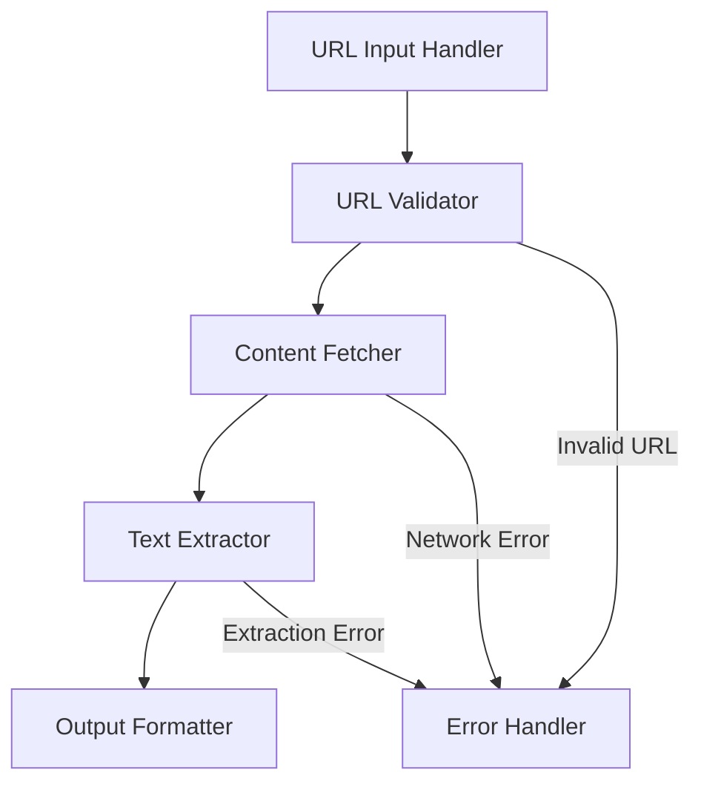

# System Patterns: URL Text Extraction Tool

## Architecture Overview

### Component Architecture

## Core Components

### 1. URL Input Handler
- Responsibility: Accept and preprocess URLs
- Pattern: Factory Pattern for different input sources
- Key Functions:
  - URL normalization
  - Input queue management
  - Batch processing support

### 2. URL Validator
- Responsibility: Validate URL format and accessibility
- Pattern: Chain of Responsibility
- Validation Steps:
  1. Format validation
  2. Protocol verification
  3. Domain resolution
  4. Robot.txt compliance

### 3. Content Fetcher
- Responsibility: Retrieve web content
- Pattern: Adapter Pattern for different protocols
- Features:
  - Rate limiting
  - Retry mechanism
  - Connection pooling
  - Header management

### 4. Text Extractor
- Responsibility: Extract and clean text content
- Pattern: Strategy Pattern for different site types
- Processing Pipeline:
  1. HTML parsing
  2. Content identification
  3. Text extraction
  4. Content cleaning

### 5. Output Formatter
- Responsibility: Format and save extracted text
- Pattern: Template Method Pattern
- Output Options:
  - Plain text
  - JSON structure
  - Streaming output

### 6. Error Handler
- Responsibility: Manage error states and recovery
- Pattern: Observer Pattern
- Error Categories:
  - Input validation errors
  - Network errors
  - Parsing errors
  - System errors

## Data Flow Patterns

### Main Processing Flow
1. Input Acceptance
2. Validation
3. Content Retrieval
4. Text Extraction
5. Output Generation

### Error Flow
1. Error Detection
2. Classification
3. Logging
4. Recovery (where possible)
5. User Notification

## Design Principles

### 1. Separation of Concerns
- Each component has a single responsibility
- Clear interfaces between components
- Modular design for easy testing

### 2. Error Handling
- Fail fast and explicitly
- Comprehensive error reporting
- Graceful degradation

### 3. Extensibility
- Plugin architecture for extractors
- Configurable processing pipeline
- Custom output formatters

## Testing Patterns
1. Unit Tests per Component
2. Integration Tests for Flows
3. Mock HTTP Responses
4. Error Case Validation

## Configuration Patterns
- External configuration file
- Environment variables
- Command line arguments
- Runtime configuration

## Monitoring Patterns
- Performance metrics
- Error rates
- Success/failure logging
- Resource usage tracking